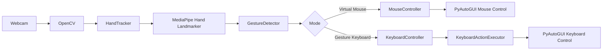

# Touchless Computer Control Using Hand Gestures

[](https://www.python.org/)
[](https://opencv.org/)
[](https://ai.google.dev/edge/mediapipe/solutions/vision/hand_landmarker)
[](https://pyautogui.readthedocs.io/)
[](https://pytest.org/)
[](https://www.microsoft.com/windows)


Control your computer using hand gestures with **Python, OpenCV, MediaPipe, and PyAutoGUI**.

The project provides two touchless interaction modes:

- 🖱️ **Virtual Mouse** — Control the cursor, click, and drag using hand gestures.
- ⌨️ **Gesture Keyboard** — Trigger keyboard actions and shortcuts using configurable hand gestures.

---

# Features

### 🖱️ Virtual Mouse

- Index finger cursor control
- Cursor smoothing
- Thumb + Index pinch for left click
- Index + Middle gesture for drag
- Click cooldown protection
- Automatic drag release when the gesture changes or the hand disappears

### ⌨️ Gesture Keyboard

- Left and right hand detection
- Finger-state-based gesture recognition
- Configurable gesture-to-action mappings
- Single-key actions
- Multi-key shortcuts
- Keyboard action cooldown
- User-friendly gesture and action status display
- Multiple keyboard profiles

### ⚙️ Project Design

- Modular architecture
- Shared hand tracking pipeline
- Centralized configuration
- Separate keyboard action executor
- Automated gesture detector tests
- Manual testing documentation

---

## Quick Start

### 1. Clone the repository

```bash
git clone https://github.com/partialHuman/Touchless-Computer-Control-Using-Hand-Gestures-Python-OpenCV-.git
```

### 2. Move into the project directory

```bash
cd Touchless-Computer-Control-Using-Hand-Gestures-Python-OpenCV-
```

### 3. Create a virtual environment

```bash
python -m venv .venv
```

### 4. Activate the virtual environment

```bash
.venv\Scripts\Activate.ps1
```

### 5. Install dependencies

```bash
pip install -r requirements.txt
```

### 6. Run the application
```bash
python main.py
```
For complete setup instructions, see the [Installation Guide](/docs/installation.md).

---

## Usage

Run the main application:

```bash
python main.py
```

You will see:

```text
=============================================
     TOUCHLESS COMPUTER CONTROL
=============================================
1. Virtual Mouse
2. Gesture Keyboard
3. Exit
=============================================
```

Select the desired option.

---

## 🖱️ Virtual Mouse

The virtual mouse uses your index finger to control the system cursor.

### Controls

| Gesture | Action |
|---|---|
| ☝️ Index finger movement | Move cursor |
| 🤏 Thumb + Index close together | Mouse click |
| `Q` | Exit Virtual Mouse |
| Close window | Exit Virtual Mouse |

---

## ⌨️ Gesture Keyboard

The keyboard controller detects the hand and finger positions and performs predefined keyboard actions.

### Left Hand

| Gesture | Action |
|---|---|
| Index + Middle | Left Arrow |
| Thumb | Space |
| Index | Alt + Tab |

### Right Hand

| Gesture | Action |
|---|---|
| Index + Middle | Right Arrow |
| Thumb | Escape |
| Index | F5 |

For all profiles and gesture details, see the Gesture [Controls Guide](/docs/controls.md).

---

# Architecture

The project separates hand tracking, gesture detection, and system control.



---

# Project Structure
```text
Touchless-Computer-Control-Using-Hand-Gestures-Python-OpenCV-
│
├── docs/
│   ├── architecture.md
│   ├── controls.md
│   ├── future-work.md
│   ├── installation.md
│   ├── report.pdf
│   ├── testing.md
│   └── usage.md
│
├── models/
│   └── hand_landmarker.task
│
├── src/
│   ├── __init__.py
│   ├── config.py
│   ├── gesture_detector.py
│   ├── hand_tracker.py
│   ├── keyboard_actions.py
│   ├── keyboard_controller.py
│   └── mouse_controller.py
│
├── tests/
│   └── test_gesture_detector.py
│
├── .gitignore
├── main.py
├── README.md
├── report.pdf
└── requirements.txt
```

# Documentation

Detailed documentation is available in the [docs/](/docs/) directory.
| Document                                     | Description                                   |
| -------------------------------------------- | --------------------------------------------- |
| [Installation Guide](docs/installation.md)   | Environment setup and dependency installation |
| [Usage Guide](docs/usage.md)                 | Running and using the application             |
| [Gesture Controls](docs/controls.md)         | Complete mouse and keyboard gesture reference |
| [Project Architecture](docs/architecture.md) | System design, modules, and workflow diagrams |
| [Testing Guide](docs/testing.md)             | Automated and manual testing procedures       |
| [Future Work](docs/future-work.md)           | Planned improvements and project roadmap      |
| [Project Report](docs/report.pdf) | Detailed project report |

---

## Testing

Run the test suite using:

```bash
pytest -v
```
See the [Testing Guide](/docs/testing.md) for the complete testing checklist and procedures.

---

## Technologies Used

| Technology | Purpose |
|---|---|
| Python | Core application |
| OpenCV | Webcam capture and display |
| MediaPipe | Hand landmark detection |
| PyAutoGUI | Mouse and keyboard control |
| Pytest | Unit testing |

---

## Future Improvements

- Double-click and right-click gestures
- Scroll control
- Adaptive cursor smoothing
- Camera selection
- Additional keyboard profiles
- Custom gesture mappings
- Debug modes
- Automated integration testing
- GitHub Actions CI
- GUI-based configuration
- Application packaging

See [Future Work](/docs/future-work.md) for the complete roadmap.

---

## License

This project is licensed under the MIT License.

---

## Disclaimer

This project is currently intended for educational and experimental use.

---
