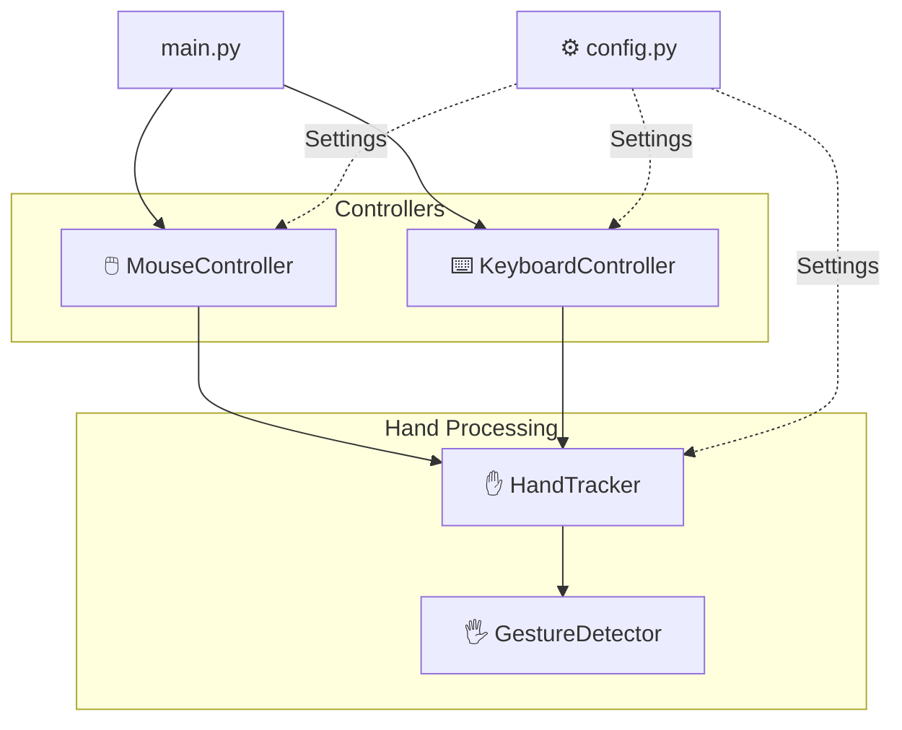

# Touchless Computer Control Using Hand Gestures

Control your computer using hand gestures through a webcam. This project uses **Python, OpenCV, and MediaPipe Hand Landmarker** to detect hand landmarks and translate gestures into mouse movements, clicks, keyboard shortcuts, and navigation controls.

## Features

- 🖱️ Virtual mouse control using hand tracking
- 👆 Index-finger-based cursor movement
- 🤏 Thumb + index gesture for mouse clicking
- ⌨️ Gesture-based keyboard controls
- ↔️ Left and right navigation gestures
- 🔄 Application switching using gestures
- ✋ Left and right hand detection
- 🎥 Real-time webcam processing
- 🧩 Modular project architecture
- ⚙️ Centralized configuration
- 🧪 Unit tests for gesture detection
- ❌ Clean camera shutdown using `Q` or the window close button

---

## Project Structure

```text
Touchless-Computer-Control-Using-Hand-Gestures-Python-OpenCV/
│
├── models/
│   └── hand_landmarker.task
│
├── src/
│   ├── __init__.py
│   ├── config.py
│   ├── gesture_detector.py
│   ├── hand_tracker.py
│   ├── keyboard_controller.py
│   └── mouse_controller.py
│
├── tests/
│   └── test_gesture_detector.py
│
├── .gitignore
├── main.py
├── README.md
├── report.pdf
└── requirements.txt
```

---

## Requirements

- Python 3.11 or compatible version
- Webcam
- Windows, Linux, or macOS

The main dependencies are:

- OpenCV
- MediaPipe
- PyAutoGUI
- Pytest

---

## Installation

### 1. Clone the repository

```bash
git clone https://github.com/partialHuman/Touchless-Computer-Control-Using-Hand-Gestures-Python-OpenCV-.git
```

### 2. Move into the project directory

```bash
cd Touchless-Computer-Control-Using-Hand-Gestures-Python-OpenCV-
```

### 3. Create a virtual environment

```bash
python -m venv .venv
```

### 4. Activate the virtual environment

#### Windows PowerShell

```powershell
.venv\Scripts\Activate.ps1
```

#### Windows Command Prompt

```cmd
.venv\Scripts\activate
```

### 5. Install dependencies

```bash
pip install -r requirements.txt
```

---

## Usage

Run the main application:

```bash
python main.py
```

You will see:

```text
=============================================
     TOUCHLESS COMPUTER CONTROL
=============================================
1. Virtual Mouse
2. Gesture Keyboard
3. Exit
=============================================
```

Select the desired option.

---

# 🖱️ Virtual Mouse

The virtual mouse uses your index finger to control the system cursor.

### Controls

| Gesture | Action |
|---|---|
| ☝️ Index finger movement | Move cursor |
| 🤏 Thumb + Index close together | Mouse click |
| `Q` | Exit Virtual Mouse |
| Close window | Exit Virtual Mouse |

---

# ⌨️ Gesture Keyboard

The keyboard controller detects the hand and finger positions and performs predefined keyboard actions.

## Left Hand

| Gesture | Action |
|---|---|
| ☝️ Index + Middle | Left Arrow |
| 👍 Thumb | Space |
| ☝️ Index | Alt + Tab |

## Right Hand

| Gesture | Action |
|---|---|
| ☝️ Index + Middle | Right Arrow |
| 👍 Thumb | Escape |
| ☝️ Index | F5 |

---

## Architecture

The project separates hand tracking, gesture detection, and system control.



---

## Configuration

Application settings are centralized in:

```text
src/config.py
```

This includes:

- Camera resolution
- Hand detection confidence
- Hand tracking confidence
- Maximum number of hands
- Mouse click threshold
- Mouse click cooldown
- Keyboard action cooldown
- MediaPipe model path

This makes the application easier to configure without modifying the controller logic.

---

## Testing

Run the test suite using:

```bash
python -m pytest -v
```

The current tests verify:

- Left/right handedness correction
- Right-hand thumb detection
- Left-hand thumb detection
- Thumb-up and thumb-down states
- Index finger detection
- Index + middle finger detection
- All-fingers-up detection

---

## Technologies Used

| Technology | Purpose |
|---|---|
| Python | Core application |
| OpenCV | Webcam capture and display |
| MediaPipe | Hand landmark detection |
| PyAutoGUI | Mouse and keyboard control |
| Pytest | Unit testing |

---

## Future Improvements

- [ ] Add gesture smoothing for cursor movement
- [ ] Add configurable gesture mappings
- [ ] Add a GUI for selecting modes
- [ ] Support multiple hands
- [ ] Add gesture customization
- [ ] Add double-click and drag gestures
- [ ] Add volume and media controls
- [ ] Add screenshots and demo GIFs
- [ ] Improve test coverage

---

## Exit Controls

Both controllers can be closed using:

```text
Q
```

or by clicking the camera window's **X** button.

---

## License

This project is available for educational and personal use.

---

## Author

Developed and improved as part of a project focused on **computer vision, hand gesture recognition, and touchless human-computer interaction**.