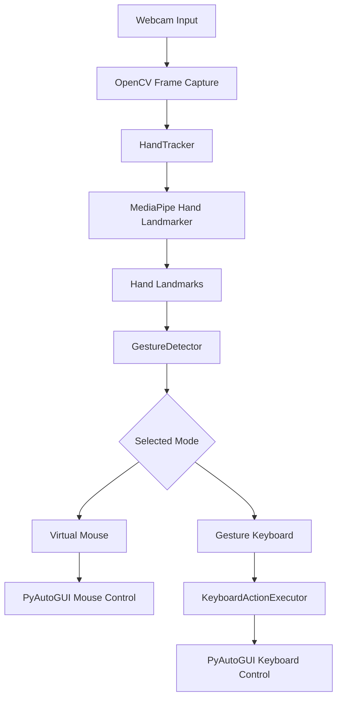
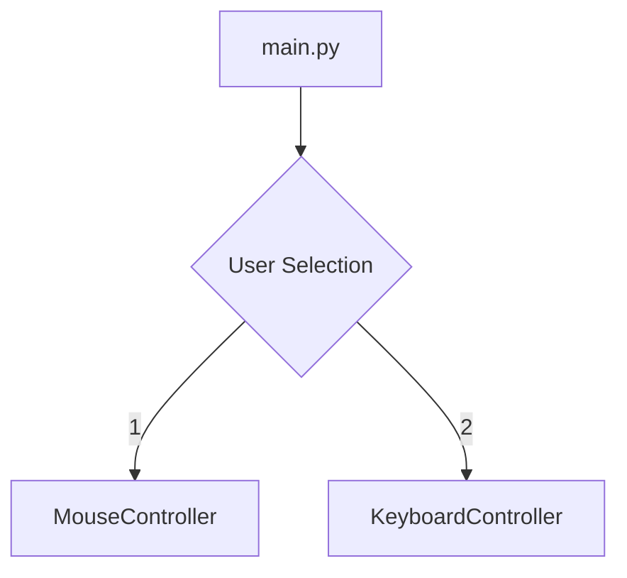
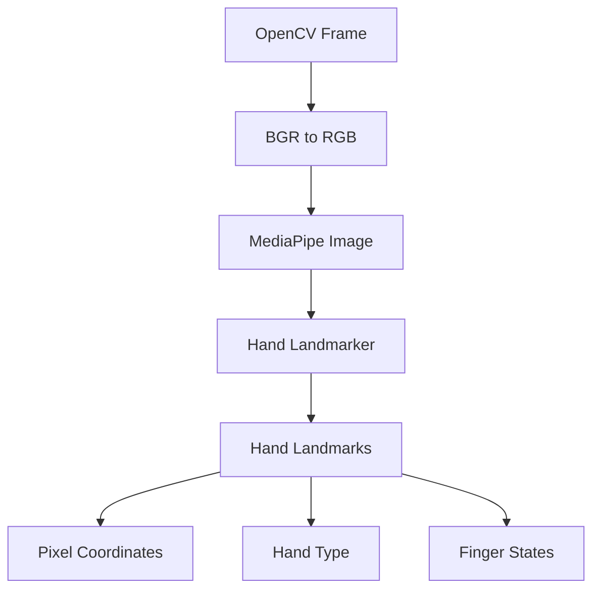
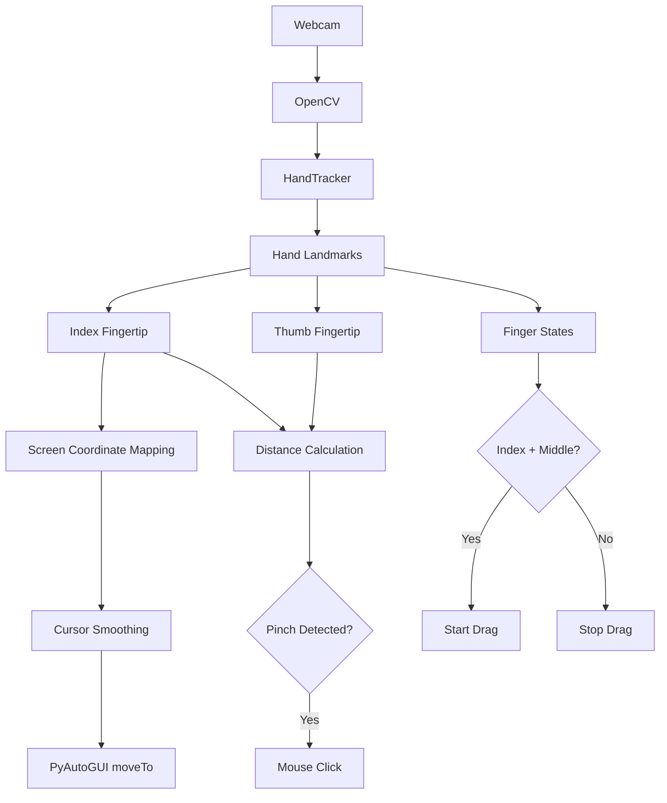
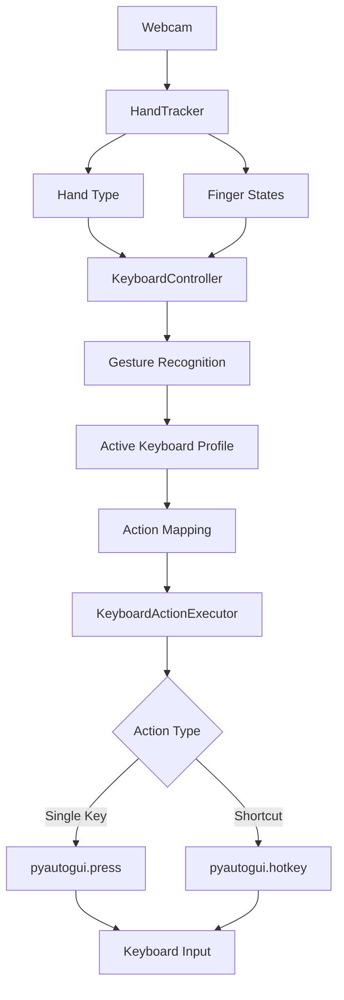
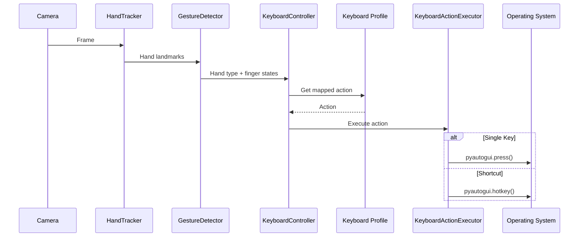
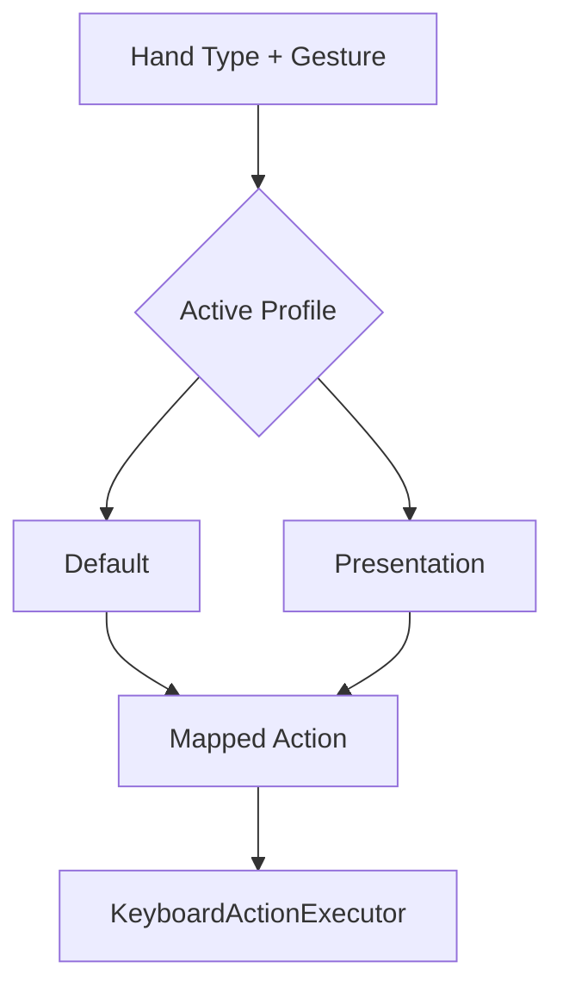
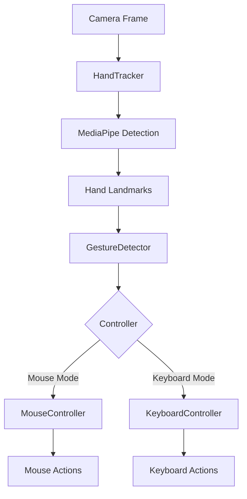
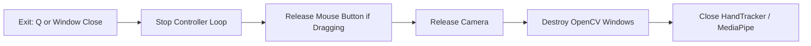

# Project Architecture

This document describes the architecture of the Touchless Computer Control system.

---

# System Overview

The project provides two computer-control modes:

1. [Virtual Mouse](#virtual-mouse-architecture)
2. [Gesture Keyboard](#gesture-keyboard-architecture)

Both modes share a common hand detection and gesture recognition pipeline.



---

# Project Structure

```
Touchless-Computer-Control-Using-Hand-Gestures-Python-OpenCV-
│
├── docs/
│   ├── installation.md
│   ├── usage.md
│   ├── controls.md
│   ├── architecture.md
│   ├── testing.md
│   └── future-work.md
│
├── models/
│   └── hand_landmarker.task
│
├── src/
│   ├── __init__.py
│   ├── config.py
│   ├── gesture_detector.py
│   ├── hand_tracker.py
│   ├── keyboard_actions.py
│   ├── keyboard_controller.py
│   └── mouse_controller.py
│
├── tests/
│   └── test_gesture_detector.py
│
├── .gitignore
├── main.py
├── README.md
├── report.pdf
└── requirements.txt
```

# Module Responsibilities

## 1. `main.py`

The application entry point.

#### Responsibilities:
- Display the controller selection menu.
- Start Virtual Mouse mode.
- Start Gesture Keyboard mode.



## 2. `src/config.py`

Contains centralized configuration values.

### Examples include:
- Camera dimensions.
- Hand detection confidence.
- Tracking confidence.
- Maximum number of hands.
- Mouse smoothing.
- Click threshold.
- Click cooldown.
- Keyboard action cooldown.
- Keyboard gesture definitions.
- Keyboard profiles.

This keeps configurable values separate from controller logic.

## 2. `src/hand_tracker.py`

Acts as the interface between the application and MediaPipe.

### Responsibilities:
- Convert OpenCV frames from BGR to RGB.
- Create MediaPipe image objects.
- Run hand landmark detection.
- Convert normalized landmarks into pixel coordinates.
- Determine hand type.
- Provide landmark information to controllers.
- Provide finger-state information.

### Hand Detection Flow



## 3. `src/gesture_detector.py`

Handles gesture interpretation.

It converts hand landmark information into finger states.

Finger state format: `[Thumb, Index, Middle, Ring, Pinky]`

For example:
```
[1, 0, 0, 0, 0] → Thumb
[0, 1, 0, 0, 0] → Index
[0, 1, 1, 0, 0] → Index + Middle
```
The gesture information is then used by the mouse and keyboard controllers.

---

# Virtual Mouse Architecture

The Virtual Mouse uses hand landmarks to control the system cursor.



## Mouse Gesture Processing

The mouse controller performs three primary functions:

### Cursor Movement
```
Index Fingertip
       ↓
Screen Coordinate Mapping
       ↓
Cursor Smoothing
       ↓
System Cursor Movement
```
### Click Detection
```
Thumb + Index
       ↓
Distance Calculation
       ↓
Below Click Threshold?
       ↓
Mouse Click
```
### Drag Detection

```
Index + Middle Raised
       ↓
Start Mouse Button Hold
       ↓
Gesture Ends
       ↓
Release Mouse Button
```

# Gesture Keyboard Architecture

The Gesture Keyboard converts recognized gestures into keyboard actions.



## Keyboard Action Flow



## Keyboard Profiles

Keyboard actions are separated into configurable profiles.


The active profile is configured in:
```
src/config.py
```
For example:
```
KEYBOARD_PROFILE = "default"
```
---

# Shared Gesture Pipeline

Both controller modes reuse the same detection components.

# Resource Cleanup

Both controllers perform cleanup when the application exits.

This ensures that the webcam and MediaPipe resources are properly released when the program terminates.

---